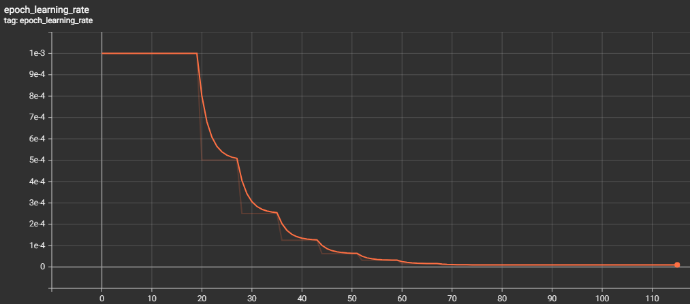
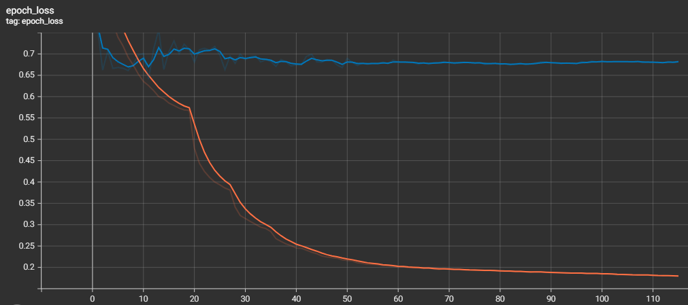
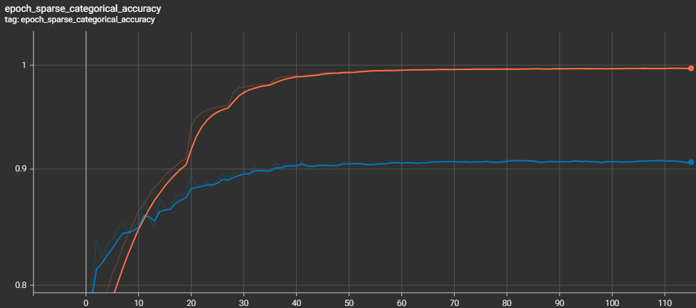

# pyfar

This repository outlines on how to reach about 90% test accuracy on the cifar-10 dataset
using as basic as possible techniques used in traditional ml and nn methodology.

# Data
- https://www.cs.toronto.edu/~kriz/cifar.html
- https://www.tensorflow.org/datasets/catalog/cifar10

# Data Summary
The cifar-10 dataset consists of 60'000 low resulution (32x32x3) images
classified in 10 classes. The training set which can be for example
used by utilizing tensorflow, is providing for each class 5'000 samples.
Furthermore it provides 10'0000 test samples to verify model performance.
Reaching above 90% test accuracy with a custom architecture is not an easy task on consumer hardware.
A list of successful configurations can be found here: [https://paperswithcode.com/sota/image-classification-on-cifar-10](https://paperswithcode.com/sota/image-classification-on-cifar-10). Tho all of them extend basic techniques of deep neurol networks to
boost classification metrics.

# Model Summary
CNN model with 2 million parameters.
The architecture consists of convolutional layers and skip connections and a final dense layer.
Skip connections help the training process by allowing values and gradients to flow more easily when
increasing the models depth to sizes which blur the contributions of the most distant layers.
In total 11 layers are utilized. One can find that very often this type of layout will reach just about under
90% validation accuracy. Performance can be boosted by applying different regularization techniques.
Namely a good boost is given when expanding the data by augmenting it using simple transformations.
These can be seen in the data.py implementation.
Multiplicative binary noise is applied to the hidden units.
It can also be thought of as an (bagged) ensemble of exponentially many neural networks.
Furthermore batch normalization can be used to reduce the effect of that the gradient assumes
that other paremeters stay constant by bringing every hidden unit to zero mean and unit variance.
This in turn can prevent exploding and vanishing gradients and keep learning stable.
Another optimization can be to deploy keras.callbacks.ReduceLROnPlateau to continuesly reduce the learning
rate once the optimizer tends to not improve anymore. The effect of this is clearly visible in the supplied figures.
Once the performance plateus we see a sudden increase after reducing the learning rate of the Adam optimizer,
tho the effect is less visible on the validation samples.

This model achieves fairly well while at the samte time beeing very easy to understand.
Comparatively it performs about the same (delta 0.6) as kMobileNet 16ch, SEER (RegNet10B), ResNet-20, ResNet-44, GP EI, 	
DNN+Probabilistic Maxout, ResNet-18, Maxout Network all the while beeing far more simple.





```
79/79 ━━━━━━━━━━━━━━━━━━━━ 4s 22ms/step - loss: 0.7537 - sparse_categorical_accuracy: 0.8990
Test Loss: 0.7438924312591553
Test Accuracy: 0.8988999724388123
```